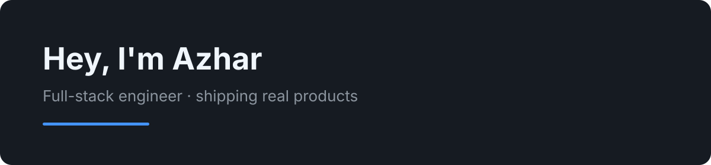

 

 

&nbsp;

 

## Tech I work with

Tech I actively work with and ship in production.

**Frontend**

**Backend**

**DevOps**

---

## What I've been building

<table>
<tr>
<td width="100%">

### 🪨 Stonecraft Imports

Live product website for an Adelaide **natural stone** supplier — pavers, tiles, pool surrounds, and showroom — designed, built, and deployed end to end.

&nbsp;

`React` `TypeScript` `Vite` `Tailwind` `Netlify`

</td>
</tr>
<tr>
<td width="100%">

### 🪜 Mezzanine

B2B platform for **S&A Stairs** — multi-tenant builder network with 3D stair design, live pricing, and quote → order (HubSpot sync), replacing spreadsheet/email workflows.

`React` `Next.js` `Django` `AWS` `HubSpot`

</td>
</tr>
<tr>
<td width="100%">

### 🏠 Shed House Australia

Procurement platform for **engineered shed / house kits** — Tekla parts lists → supplier pricing rules → POs → delivery tracking, cutting manual matching and order creation.

`React` `Django` `PostgreSQL` `Docker`

</td>
</tr>
</table>

---

## What I focus on

Production-grade interfaces, clean TypeScript/React, scalable Django backends, and DevOps practices that hold up once real users show up.

---

Interested in working together? **[Let's chat](mailto:azharsharif042@gmail.com)** about your project.

 

Innovaxel · Lahore

